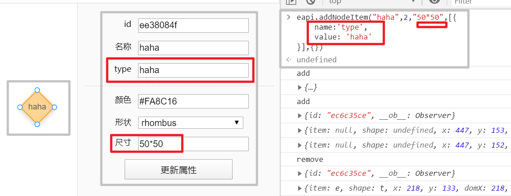

# go_utils_public

这个是从私有项目中单独分离出来的

> 本项目的 src 文件夹 📂 介绍请参见[此处](./docs/src.md)

> 使用到的技术及网址(以下网址尽可能保留非GitHub链接本地版本)

> 使用的 ui 为 [iview](https://www.iviewui.com/components)

[🔗 用Go实现CORS跨域资源共享的服务器支持](http://semicircle.github.io/blog/2013/09/29/go-with-cors/)

[🔗 statik 实现将html打包放入go中](https://github.com/rakyll/statik)
```shell script
# 本项目中的用法如下
statik -src=html
```

[🔗 websocket long connect](https://github.com/qianlnk/longsocket)

[🔗 编码识别](https://github.com/saintfish/chardet)

[🔗 解析 URI 加号丢失](https://blog.csdn.net/Yvken_Zh/article/details/104861765)

```go
detector：= chardet.NewTextDetector()
result，err：= detector.DetectBest(some_text)

if err == nil {
 fmt.Printf（
"检测到的字符集为％s，语言为％s ",
 result.Charset,
 result.Language）
} 
```

[🔗 Sqlite3](https://github.com/mattn/go-sqlite3)

```shell script
# 更新数据库代码的方法是
# 将工作目录移动到 BuildSql.js 目录下
# src/utils/SqliteSql>
node BuildSqls.js ./../../main/Sqls/db.json
```

关于流程图的页面
- [GitHub 搜素](https://github.com/search?q=flowchart-vue&type=Repositories)
- [流程控制](https://github.com/caoyu48/vue-g6-editor)
- [X-FCV](https://github.com/OXOYO/X-Flowchart-Vue)
- [demo-jsPlumb](https://github.com/smile1828/demo-jsPlumb)
- [vuepress-plugin-flowchart](https://github.com/ulivz/vuepress-plugin-flowchart)
- [g6editor-vue](https://github.com/fanlinqiang/g6editor-vue)
- [easy-flow](https://gitee.com/xiaoka2017/easy-flow)

最后选中的```流程图编辑器```是下面这个
- [vue-flowchart-editor](https://github.com/jnoodle/vue-flowchart-editor)

修改了一下内容，另外打包代码是 ```vue-cli-service build src/demo/app.js```
```html
<h1>第一部分 src/demo/demo.vue</h1>
<!-- 添加 refs 引用 -->
<flowchart-editor
    :read-only="readOnly"
    :key="reRender"
    :chart-data="flowChartData"
    :chart-data-node-items="flowChartNodeItems"
    @save-data="save"
    ref="flowchart-editro"
/>
<script>
// import chartData from './data'
// import dataNodeItems from './dataNodeItems'
import {ExportAPIs} from "./exportAPIs";
// 在mounted 方法中添加以下内容
window.onresize = function() {
  if (window.minimap) {
    window.minimap.getGraph().changeSize(window.innerWidth - 301 - 151,window.innerHeight - 49);
  }
};
window.eapi = new ExportAPIs(this);
</script>

<h1>第二部分 src/components/Minimap/index.js</h1>
<script >
// Line:54行
window.minimap = this.minimap = new G6.Components.Minimap({
    container,
    width: width || clientWidth,
    height: height || clientHeight,
    viewportWindowStyle,
    viewportBackStyle,
})
</script>

<h1>第三部分 src\demo\flowchartEditor.vue</h1>
<!-- 添加 refs 引用 -->
<vue-flowchart-editor class="vue-flowchart-editor" ref="flowChart">

<h1>第四部分 src\demo\components\CustomCommand.vue</h1>
<script >
// Line:33
window.propsAPI = propsAPI;
</script>

<h1>第五部分 添加一个脚本 src\demo\exportAPIs.js</h1>
```

暴露 api 如下

|api|作用|
|----|----|
|eapi.addNodeItem|添加节点类型|
|eapi.setDatas|设置流程图信息|
|eapi.getData|获取流程图|



```javascript
// 添加节点类型
eapi.addNodeItem("haha",2,"50*50",[{
    name:'type',
    value: 'haha'
}],{});
// 初始化一个已有的流程图
eapi.setDatas({
  nodes: [
    {
      type: 'node',
      size: '72*72',
      shape: 'flow-circle',
      color: '#FA8C16',
      label: '开始',
      x: 468,
      y: 61,
      id: '01729835',
      index: 0,
      data: [
        {
          name: 'prop1',
          value: 'prop1',
        },
        {
          name: 'prop2',
          value: 'prop2',
        },
      ],
    },
    {
      type: 'node',
      size: '80*48',
      shape: 'flow-rect',
      color: '#1890FF',
      label: '测试节点',
      x: 468,
      y: 201.5,
      id: 'b69121d6',
      index: 1,
      data: [
        {
          name: 'prop3',
          value: 'prop3',
        },
        {
          name: 'prop4',
          value: 'prop4',
        },
      ],
    },
  ],
  edges: [
    {
      source: '01729835',
      sourceAnchor: 2,
      target: 'b69121d6',
      targetAnchor: 0,
      id: '070785c1',
      index: 4,
    },
  ],
});
// 获取流程图
let lct = eapi.getData();
```

----

iview 标签转换
```text
Button: i-button
Col: i-col
Table: i-table
Input: i-input
Form: i-form
Menu: i-menu
Select: i-select
Option: i-option
Progress: i-progress
Time: i-time
MenuItem：Menu-Item
RadioGroup：Radio-Group
<Icon / >：<Icon ></Icon>
FormItem：Form-Item
Header:i-header
Content:i-content
TabPane:tab-pane
```